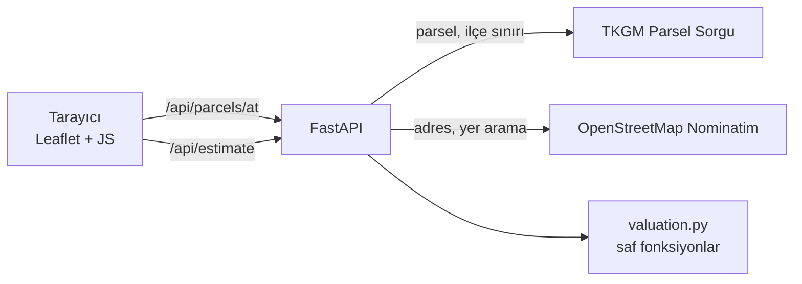

# Değerix

[](https://github.com/kayaal34/degerix/actions/workflows/tests.yml)

Haritada bir arsaya tıklayın ya da ada/parsel numarasını girin. Değerix, parseli
**TKGM (Tapu ve Kadastro) kaydından** bulur, sınırını haritada çizer ve tahmini
değerini, hesabın adım adım dökümüyle birlikte gösterir.

**Teknolojiler:** Python 3.12 · FastAPI · httpx · Leaflet · Vanilla JS · pytest · GitHub Actions

## Özellikler

- **Haritadan seçim:** tıklanan noktadaki gerçek parsel TKGM'den gelir: ada, parsel, yüzölçümü, nitelik ve sınır poligonu.
- **Ada / parsel ile arama:** il → ilçe → mahalle listeleri de TKGM'den gelir.
- **Yer arama:** OpenStreetMap ile ("Yalıkavak, Bodrum").
- **Telefonda:** arsanın üzerindeyken "Bulunduğum yeri seç" ile parseli GPS'ten bulma, dokunmatik uyumlu arayüz.
- **Şeffaf hesap:** tek bir rakam yerine değer aralığı, güven düzeyi ve her çarpanın gerekçesi gösterilir.
- **Yedek akış:** parsel kaydı olmayan noktalarda il/ilçe OpenStreetMap'ten alınır, alanı kullanıcı girer.
- **Paylaşılabilir bağlantı:** `?lat=..&lng=..` ile aynı parsel yeniden açılır.
- **Harita / uydu görünümü.**

## Nasıl çalışır?



Tarayıcı dış servislere doğrudan gitmez; FastAPI araya girer. Böylece TKGM'nin
tutarsız yanıtları tek yerde düzeltilir (ör. alanın bazen `45,911.00`, bazen
`45.911,00` biçiminde gelmesi, "Gölbaşi" gibi bozuk ad yazımları), idari listeler
önbelleğe alınır ve Nominatim'in saniyede bir istek sınırına uyulur.

## Değerleme modeli

```text
m² fiyatı = il referans fiyatı
          × ilçe katsayısı       bilinen ilçeler için bölge farkı
          × konum katsayısı      ilçenin coğrafi merkezine uzaklık (TKGM ilçe sınırından), 0,85 – 1,10
          × kullanım katsayısı   konut / ticari / sanayi / bağ-bahçe / zeytinlik / tarla
          × büyüklük katsayısı   büyük parselde m² fiyatı düşer
```

Model deterministiktir: aynı girdi her zaman aynı sonucu verir. Eksik veri (tanımsız
ilçe, alınamayan ilçe sınırı, kırsal kullanım) değer aralığını genişletir ve güven
düzeyini düşürür.

Örnek: Bodrum, Yeniköy, 1108 ada 6 parsel (467,87 m², konut)

| Adım | Çarpan | m² fiyatı |
|---|---|---|
| Muğla referans fiyatı | | ₺8.800 |
| İlçe: Bodrum | × 2,30 | |
| Konum: ilçe merkezine 7,8 km | × 0,98 | |
| Kullanım: konut imarlı arsa | × 1,00 | |
| Büyüklük: 468 m² | × 1,01 | |
| **Sonuç** | | **₺19.900** → **₺9.310.000** (8,4 – 10,2 milyon ₺) |

> **Önemli:** `app/data.py` içindeki referans fiyatlar ve katsayılar gerçek piyasa verisi
> değil, modelin çalışmasını göstermek için seçilmiş örnek değerlerdir. Parsel bilgileri
> (konum, alan, nitelik) ise gerçektir. Gerçek bir fiyat kaynağı bağlandığında yalnızca
> `data.py` dosyasının değişmesi yeterlidir.

## Çalıştırma

Python 3.12 gerekir.

```bash
python -m venv .venv
```

```bash
.venv\Scripts\activate
```

```bash
pip install -r requirements.txt
```

```bash
uvicorn app.main:app --reload
```

- Arayüz: <http://localhost:8000>
- API dokümanı (Swagger): <http://localhost:8000/docs>

### Telefondan denemek (aynı Wi-Fi)

Sunucuyu yerel ağa açın:

```bash
uvicorn app.main:app --host 0.0.0.0 --port 8000
```

Bilgisayarın yerel IP adresini `ipconfig` ile öğrenin (ör. `192.168.1.34`) ve telefonda
`http://192.168.1.34:8000` adresini açın. Windows güvenlik duvarı izin isteyebilir.

"Bulunduğum yeri seç" düğmesi tarayıcı kuralı gereği yalnızca **https** üzerinde çalışır;
yerel ağda çalışmaz, yayınlanmış sürümde çalışır.

## Yayınlama (Render)

Depoda hazır bir [`render.yaml`](render.yaml) bulunur.

1. [render.com](https://render.com)'a GitHub hesabıyla giriş yapın.
2. **New → Blueprint** seçip bu depoyu bağlayın.
3. Render servisi kurar ve `https://degerix-xxxx.onrender.com` biçiminde bir adres verir. Her `git push` sonrası otomatik güncellenir.

Ücretsiz planda servis 15 dakika istek almazsa uyur; sonraki ilk açılış yaklaşık bir dakika sürer.

## Testler

```bash
pytest
```

56 test ağa çıkmadan çalışır; TKGM ve Nominatim sabit verilerle taklit edilir. Her push'ta GitHub Actions üzerinde de çalışır. Kapsanan konular:

- **Değerleme modeli:** determinizm, dökümün kendi içinde tutarlılığı, güven düzeyleri
- **Coğrafi hesaplar:** mesafe, poligon merkezi ve alanı
- **Veri ayrıştırma:** TKGM'nin iki farklı sayı biçimi, nitelik metninden kullanım türü tahmini
- **API:** yedek akışlar (TKGM kapalıyken ya da parsel yokken), 404/422/502 yanıtları

## API

| Metot | Yol | Açıklama |
|---|---|---|
| GET | `/api/parcels/at?lat=&lng=` | Koordinattaki parsel; kayıt yoksa OSM adresi (`source: "osm"`) |
| GET | `/api/parcels/{mahalle_id}/{ada}/{parsel}` | Ada/parsel ile parsel |
| POST | `/api/estimate` | `{province, district, area_m2, usage, lat?, lng?, province_id?, district_id?}` → tahmin |
| GET | `/api/provinces` · `/api/provinces/{id}/districts` · `/api/districts/{id}/neighborhoods` | İdari listeler |
| GET | `/api/search?q=` | Yer arama |
| GET | `/api/usages` | Kullanım türleri |

Hata yanıtları `{"detail": "Türkçe açıklama"}` biçimindedir. Kayıt yoksa 404,
girdi geçersizse 422, dış servise ulaşılamazsa 502 döner.

## Proje yapısı

```text
app/
  main.py          FastAPI uç noktaları ve şemalar
  valuation.py     değerleme modeli (saf fonksiyonlar)
  data.py          referans fiyatlar, katsayılar, Türkçe ad eşleştirme
  geo.py           mesafe, poligon merkezi ve alanı
  tkgm.py          TKGM istemcisi + önbellek
  nominatim.py     OpenStreetMap istemcisi (hız sınırlı)
  errors.py        ortak hata tipleri
static/            arayüz (index.html, style.css, app.js)
tests/             pytest
render.yaml        Render yayın tanımı
```

## Bilinen sınırlamalar

- **TKGM API'si:** kullanılan TKGM uç noktaları parselsorgu.tkgm.gov.tr'nin herkese açık servisidir, resmî olarak belgelenmemiştir. Biçim değişebilir ve yoğun kullanımda istek sınırına takılabilir.
- **Konum katsayısı:** ilçenin coğrafi merkezini kullanır. Bu nokta her zaman şehir merkezi değildir; geniş ilçelerde (ör. Çankaya) sapma olabileceği için etki 0,85 – 1,10 bandında tutulur.
- **Nitelik ≠ imar durumu:** nitelikten tahmin edilen kullanım türü imar durumu değildir. Kullanıcı arayüzde değiştirebilir.
- **Harita altlıkları:** OpenStreetMap karoları ve Esri uydu görüntüsü API anahtarı gerektirmez ama düşük trafikli kullanım içindir ([OSM karo politikası](https://operations.osmfoundation.org/policies/tiles/)). Yoğun trafikte ücretli bir karo sağlayıcısına geçilmelidir.

## Yol haritası

- **Bölge istatistikleri:** TCMB EVDS'den il bazında konut birim m² fiyatları ve konut fiyat endeksi
- **Emsal girişi:** kullanıcının bulduğu ilan fiyatlarından bölge ortalaması
- **Ek sorular:** imar durumu ve emsal (KAKS), hisseli tapu, yol cephesi, altyapı

## Yasal uyarı

Değerix bir portfolyo projesidir. Sunulan tahminler bilgilendirme amaçlıdır; yatırım
tavsiyesi değildir ve SPK lisanslı gayrimenkul değerleme raporu yerine geçmez.
