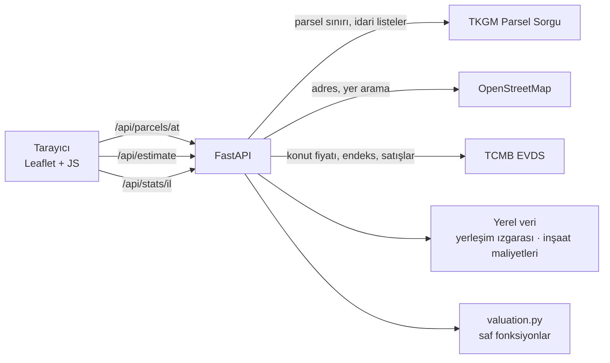

# Değerix

[](https://github.com/kayaal34/degerix/actions/workflows/tests.yml)

Haritada bir arsaya tıklayın ya da ada/parsel numarasını girin. Değerix parseli
**TKGM kaydından** bulur, sınırını haritada çizer ve değerini **resmî verilerle**
hesaplar: Merkez Bankası'nın güncel konut fiyatları, Bakanlığın inşaat maliyetleri
ve uydu nüfus verisinden çıkarılan yerleşim sınıfı. Sonuç tek bir rakam değil;
**acil satış, piyasa değeri ve tok satıcı** fiyatları, değer aralığı ve hesabın
adım adım dökümüdür.

**Teknolojiler:** Python 3.12 · FastAPI · httpx · Leaflet · Vanilla JS · pytest · GitHub Actions

## Özellikler

- **Haritadan seçim:** tıklanan noktadaki gerçek parsel TKGM'den gelir: ada, parsel, yüzölçümü, nitelik ve sınır poligonu.
- **Ada / parsel ile arama:** il → ilçe → mahalle listeleri de TKGM'den gelir.
- **Resmî veriye dayalı model:** değer, lisanslı değerleme uzmanlarının kullandığı geliştirme (artık değer) yöntemiyle hesaplanır; girdiler TCMB, Resmî Gazete ve uydu verisidir.
- **Şehir ile köyü ayırt eder:** parselin 1 km²'lik hücresi "şehir merkezi · yoğun kentsel küme · kasaba · şehir çeperi · köy · kırsal" olarak sınıflanır.
- **Arsa soruları:** imar durumu ve emsal (KAKS, inşaat alanı canlı hesaplanır), müstakil/hisseli tapu (hisse payının değeri ayrıca gösterilir), yol cephesi, elektrik ve su, deniz/göl manzarası, köşe parsel (imarlı arsada), sulu/kuru (imarsız arazide). Sorular yalnızca ilgili durumda görünür; zeytinlikte yasal kısıt uyarısı çıkar.
- **Parsel çevresi:** kıyıya ve ana yola mesafe, 1 km içindeki okul/sağlık/market noktaları ve eğim otomatik ölçülür. Ölçüm 4 saniyede yetişmezse değer beklemeden gösterilir.
- **Satış süresine göre fiyat:** acil satış (1–2 ay), piyasa değeri (3–6 ay) ve tok satıcı (6 ay+) için ayrı fiyat ve aralık.
- **Bölge analizi:** TCMB EVDS'den ilin konut m² fiyatı, bölge konut fiyat endeksi (24 aylık grafik) ve son 12 ayın konut satışları.
- **Şeffaf hesap:** değer aralığı, güven düzeyi ve her adımın gerekçesi gösterilir. "Bilmiyorum" denen sorular aralığı genişletir.
- **Telefonda:** arsanın üzerindeyken "Bulunduğum yeri seç" ile parseli GPS'ten bulma, dokunmatik uyumlu arayüz.
- **Harita / Uydu düğmesi:** parsel seçilince uydu görüntüsü kendiliğinden açılır; kullanıcının kendi seçimi hatırlanır.
- **Yazdırılabilir / PDF rapor:** parsel krokisi, verilen yanıtlar, değer, senaryolar, bölge analizi ve hesabın tam dökümü tek sayfada.
- **İki parseli karşılaştırma:** değer, m² fiyatı, aralık ve senaryolar yan yana; liste yalnızca kullanıcının tarayıcısında saklanır.
- **Yer arama** (OpenStreetMap) ve **paylaşılabilir bağlantı:** bağlantı parselle birlikte yanıtları da taşır; açan kişi aynı sonucu görür.
- **Yedek akış:** parsel kaydı olmayan noktalarda il/ilçe OpenStreetMap'ten alınır, alanı kullanıcı girer.

## Nasıl çalışır?



Tarayıcı dış servislere doğrudan gitmez; FastAPI araya girer. Bunun üç faydası var:

- **Tutarsız yanıtlar tek yerde düzeltilir.** TKGM alanı bazen `45,911.00`, bazen `45.911,00` biçiminde döndürüyor; bazı adları da "Gölbaşi" gibi bozuk yazıyor.
- **Anahtar ve önbellek sunucuda kalır.** EVDS API anahtarı tarayıcıya hiç gitmez.
- **Hız sınırlarına uyulur.** Nominatim'in saniyede bir istek sınırı aşılmaz, Overpass sorguları paylaşılır.

## Değerleme modeli

Model, arsayı satın alacak kişinin mantığını kurar: **arsanın değeri, üzerine
yapılabilecek şeyin değerinden geriye kalandır.**

### 1. Bölgedeki konut fiyatı

```text
bölgedeki konut m² fiyatı = TCMB'nin il konut m² fiyatı × yerleşim katsayısı
```

TCMB'nin il fiyatı ağırlıklı olarak şehir merkezini yansıtır; yerleşim katsayısı bunu
parselin bulunduğu yere indirger:

| Yerleşim sınıfı | Katsayı | Örnek |
|---|---|---|
| Şehir merkezi | 1,05 | Kadıköy, Kızılay, Nilüfer |
| Yoğun kentsel küme | 0,85 | Mudanya, Bodrum |
| Şehir çeperi | 0,80 | büyük şehrin kenar mahalleleri |
| Kasaba | 0,70 | Alaçam ilçe merkezi |
| Köy | 0,50 | köy yerleşiği |
| Seyrek kırsal | 0,42 | |
| Çok seyrek kırsal | 0,36 | dağ köyleri, kırsal parseller |

Izgara 1 km çözünürlükte olduğu için sınıf sınırlarında sertlik oluşmasın diye hücrenin
katsayısı 2 km çevresindeki en kentsel sınıfla harmanlanır: köyün hemen kenarındaki parsel
bomboş kırsalla aynı sayılmaz. Parsel **il merkezinin içindeyse** katsayı il ortalamasının
(1,00) altına düşmez; TCMB'nin il fiyatı zaten ağırlıklı olarak o şehirden gelir.

### 2. İmarlı arsa: geliştirme (artık değer) yöntemi

```text
yeni konut fiyatı = bölgedeki konut fiyatı × yeni konut primi (1,20)
hasılat           = inşaat hakkı × satılabilir oran (0,80) × yeni konut fiyatı
maliyet           = inşaat hakkı × Bakanlık yapı birim maliyeti
arsa              = hasılat − maliyet − geliştirici payı (hasılatın %15'i)
```

TCMB'nin fiyatı tüm konut stokunun (eski + yeni) ortalamasıdır; müteahhit ise yeni daire
satar ve yeni konut ortalamanın üstünde fiyatlanır. Bu fark **yeni konut primi** olarak
hesaba girer.

İnşaat maliyeti, Çevre ve Şehircilik Bakanlığının 2026 tebliğinden gelir. Yapı sınıfı
hem yerleşime hem de **bölgedeki konut fiyatına** bakılarak seçilir: konutun 25.000 ₺/m²'ye
satıldığı bir şehirde 21.000 ₺/m² maliyetli bina yapılmaz.

| Bölgedeki konut fiyatı | Konut | Ticari |
|---|---|---|
| 55.000 ₺/m² ve üzeri | III-B (21.050 ₺/m²) | III-C (23.400 ₺/m²) |
| 32.000 – 55.000 ₺/m² | III-A (19.800 ₺/m²) | III-B (21.050 ₺/m²) |
| 32.000 ₺/m² altı | II-C (15.100 ₺/m²) | III-A (19.800 ₺/m²) |
| Kırsal yerleşim (köy ve altı) | II-C, köy evi | III-A |

**Hasılat maliyeti karşılamıyorsa** (köylerde çoğu zaman böyledir) geliştirme hesabı
arsaya değer bırakmaz. O zaman değer "taban orandan" gelir: orada arsayı alan kişi
müteahhit değil, kendi evini yapacak kişidir. Taban oran, bölgedeki konut fiyatının
şehirde %10'u, köyde %3'ü, kırsalda %1,8'idir.

### 3. İmarsız arazi

Tarla, bağ-bahçe ve zeytinlik için değer, bölgedeki konut fiyatının yerleşime ve
kullanıma bağlı oranıdır (kırsalda %0,6 – şehir çeperinde %2; zeytinlikte 1,6 katı).

### 4. Düzeltmeler

Bulunan m² değeri şu çarpanlarla düzeltilir:

| Çarpan | Nasıl belirlenir | Aralık |
|---|---|---|
| Denize yakınlık | kıyı çizgisine mesafe (OpenStreetMap); 3 km ötesinde etkisiz | 1,00 – 1,20 |
| Ana yola erişim | en yakın ana yola mesafe (OpenStreetMap) | 0,90 – 1,05 |
| Çevre hizmetleri | 1 km içindeki okul, sağlık ve market noktası sayısı | 0,95 – 1,05 |
| Eğim | parselin çevresindeki yükselti farkı (Open-Meteo, Copernicus) | 0,85 – 1,00 |
| Merkeze yakınlık | yalnızca kırsalda: ilçe merkezine uzaklık | 1,00 – 1,20 |
| Büyüklük | büyük parselde m² fiyatı düşer | 0,65 – 1,08 |
| Tapu | hisseli tapuda ortaklık indirimi | 0,80 – 1,00 |
| Yol cephesi | yola cephesi yoksa geçit hakkı gerekir | 0,75 – 1,00 |
| Elektrik ve su | eksikse düşer; tarlada etkisi daha az | 0,85 – 1,00 |
| Manzara / köşe parsel | yalnızca yanıtlanınca uygulanır | 1,00 – 1,12 |
| Sulama (imarsız) | sulu arazi kuru araziden pahalıdır | 0,90 – 1,20 |
| Emsaller | kullanıcının girdiği ilan/satışların ortancası; ağırlık emsal sayısıyla artar (%20 → %60) | emsale göre |

**Değer aralığı ve güven:** her eksik bilgi aralığı genişletir — yerleşim bilgisi
alınamaması, TCMB'nin o il için fiyat yayımlamaması, canlı veri yerine kopya
kullanılması, girilmemiş emsal ve "Bilmiyorum" denen her soru. Kullanıcı yanıtladıkça
aralık daralır, güven "düşük → orta → yüksek" olur.

**Satış senaryoları:** piyasa değeri 3–6 aylık normal satışı temsil eder. Acil satışta
imarlı arsa ×0,85, imarsız arazi ×0,78 (arazi daha yavaş satılır); tok satıcıda
×1,08 / ×1,10 uygulanır.

Model deterministiktir: aynı girdi her zaman aynı sonucu verir.

### Örnekler (Eylül 2026)

**Samsun Alaçam, köy içi parsel · 700 m² · konut imarlı · emsal 0,50**

| Adım | Değer |
|---|---|
| Samsun konut m² fiyatı (TCMB) | ₺37.326 |
| Yerleşim: çok seyrek kırsal (10 kişi/km²) | × 0,36 → ₺13.437 |
| Geliştirme: 350 m² inşaat hakkı | hasılat maliyeti karşılamıyor → **değer bırakmıyor** |
| Taban değer (konut fiyatının %1,8'i) | ₺242/m² |
| Merkeze yakınlık (Yakakent 6,9 km) | × 1,10 |
| **Sonuç** | **₺182.000** (₺260/m²) · aralık ₺158.000 – ₺206.000 |

Aynı parselin ilan fiyatı 245.000 ₺ (350 ₺/m²). İlan, satıcının istediği fiyattır;
tahminin bir miktar altında kalması beklenir.

**Bodrum Yeniköy 1108 ada 6 parsel · 467,87 m² · konut imarlı**

| Adım | Değer |
|---|---|
| Muğla konut m² fiyatı (TCMB) | ₺82.290 |
| Yerleşim: yoğun kentsel küme | × 0,85 → ₺69.947 |
| Yeni konut primi | × 1,20 → ₺83.936 |
| Geliştirme: 561 m² inşaat hakkı (III-B) | hasılat ₺37,7M − maliyet ₺11,8M − pay ₺5,7M = ₺20,2M |
| **Sonuç** | **₺20.300.000** (₺43.400/m²) · güven yüksek |

> **Neyi biliyoruz, neyi varsayıyoruz:** konut fiyatları, inşaat maliyetleri, parsel
> bilgileri ve nüfus verisi resmîdir. Yerleşim katsayıları, taban oranlar, arazi
> oranları ve geliştirici payı ise başlangıç varsayımıdır; `app/model_params.py`
> içinde durur ve gerçek satış verisiyle ayarlanmayı bekler (bkz. [Kalibrasyon](#kalibrasyon)).

## Veri kaynakları

| Kaynak | Ne için | Lisans / not |
|---|---|---|
| [TKGM Parsel Sorgu](https://parselsorgu.tkgm.gov.tr) | Parsel sınırı, alan, nitelik, idari listeler | Resmî olarak belgelenmemiş kamuya açık servis |
| [TCMB EVDS](https://evds3.tcmb.gov.tr) | İl konut m² fiyatı, konut fiyat endeksi, satış sayıları | Ücretsiz API anahtarı |
| Çevre ve Şehircilik Bakanlığı | 2026 yapı yaklaşık birim maliyetleri | Resmî Gazete, 3/2/2026, sayı 33157 |
| [WorldPop](https://www.worldpop.org) | 1 km nüfus ızgarası → yerleşim sınıfı | CC BY 4.0 |
| [GeoNames](https://www.geonames.org) | İl/ilçe merkezleri ve köyler | CC BY 4.0 |
| [OpenStreetMap](https://www.openstreetmap.org/copyright) | Kıyı, yollar, hizmet noktaları, yer arama, harita | ODbL |
| [Open-Meteo](https://open-meteo.com) | Yükselti (Copernicus DEM) → eğim | CC BY 4.0 |

Yerleşim sınıfları, Birleşmiş Milletler / Eurostat "kentleşme derecesi" (Degree of
Urbanisation) eşikleriyle üretilir; sınıf kodları GHS-SMOD ile aynıdır.

## Çalıştırma

Python 3.12 gerekir.

```bash
python -m venv .venv
```

```bash
.venv\Scripts\activate
```

```bash
pip install -r requirements.txt
```

```bash
uvicorn app.main:app --reload
```

- Tanıtım sayfası: <http://localhost:8000>
- Harita uygulaması: <http://localhost:8000/harita.html>
- API dokümanı (Swagger): <http://localhost:8000/docs>

### EVDS API anahtarı (isteğe bağlı)

Anahtar yoksa uygulama çalışır: konut fiyatları `app/static_data/konut_birim_fiyat.json`
içindeki kopyadan okunur, yalnızca bölge analizi kartı gizlenir.

1. [evds3.tcmb.gov.tr](https://evds3.tcmb.gov.tr) adresinde ücretsiz üye olun ve profil sayfanızdan API anahtarınızı kopyalayın.
2. [`.env.example`](.env.example) dosyasını `.env` adıyla kopyalayın.
3. Anahtarı `EVDS_API_KEY=` satırına tırnaksız yapıştırın ve sunucuyu yeniden başlatın.

`.env` git'e gönderilmez. Anahtar yalnızca sunucuda kullanılır, tarayıcıya gönderilmez.

### Veri dosyalarını yeniden üretmek

Statik veriler depoda hazır gelir. Güncellemek için:

```bash
pip install -r requirements-dev.txt
```

```bash
python tools/build_urbanity.py
```

```bash
python tools/build_settlements.py
```

```bash
python tools/build_housing_prices.py
```

Sırasıyla yerleşim ızgarasını (WorldPop), yerleşim listesini (GeoNames) ve konut fiyatı
kopyasını (EVDS, anahtar gerekir) üretirler.

### Telefondan denemek (aynı Wi-Fi)

```bash
uvicorn app.main:app --host 0.0.0.0 --port 8000
```

Bilgisayarın yerel IP adresini `ipconfig` ile öğrenin (ör. `192.168.1.34`) ve telefonda
`http://192.168.1.34:8000` adresini açın. "Bulunduğum yeri seç" düğmesi tarayıcı kuralı
gereği yalnızca **https** üzerinde çalışır.

## Yayınlama (Render)

Depoda hazır bir [`render.yaml`](render.yaml) bulunur.

1. [render.com](https://render.com)'a GitHub hesabıyla giriş yapın.
2. **New → Blueprint** seçip bu depoyu bağlayın.
3. Render `EVDS_API_KEY` değerini sorar; boş bırakırsanız bölge analizi kapalı kalır.
4. Her `git push` sonrası otomatik güncellenir.

Ücretsiz planda servis 15 dakika istek almazsa uyur; sonraki ilk açılış yaklaşık bir dakika sürer.

## Kalibrasyon

Model katsayıları (`app/model_params.py`) başlangıç varsayımıdır. Gerçek kayıtlarla
ayarlanmaları planlanır:

- `data/pilot/bursa.csv` — belediye ihaleleri, KAP değerleme raporları ve belediye birim değerleri gibi **kaynağı belli, kamuya açık** kayıtlar (depoda).
- `data/private/` — ilan sitelerinden elle derlenen doğrulama kayıtları. **Git'e gönderilmez**; ham ilan verisi yeniden yayımlanmaz, kişisel veri tutulmaz. İlan fiyatı satış fiyatı olmadığı için ayrı bir pazarlık payı parametresiyle karşılaştırılır.

Uygulamadaki **emsal girişi**, girilen emsalleri kalibrasyon betiğinin beklediği sütunlarla
CSV olarak dışa aktarır; dosya doğrudan `data/private/` içine konabilir.

Kalibrasyon sonucu yalnızca katsayı olarak (`app/static_data/calibration.json`) depoya girer.

## Araçlar

| Komut | Ne yapar |
|---|---|
| `python tools/sanity_check.py` | Örnek noktalarda modeli çalıştırır; şehir > çeper > kasaba > köy > kırsal gibi kuralları doğrular |
| `python tools/province_sweep.py` | 81 il merkezinde aynı parseli hesaplar, uç değerleri ve taban orana düşen illeri işaretler |
| `python tools/calibrate.py` | Gerçek kayıtlarla modelin hatasını ölçer; `--uygula` ile katsayıları yazar |
| `python tools/build_urbanity.py` | WorldPop nüfus ızgarasından yerleşim sınıflarını üretir |
| `python tools/build_settlements.py` | GeoNames'ten il/ilçe merkezi ve köy listesini üretir |
| `python tools/build_housing_prices.py` | TCMB'den il konut fiyatlarının yedek kopyasını üretir |

Veri hazırlama betikleri `requirements-dev.txt` gerektirir; uygulama çalışırken bunlara
ihtiyaç duyulmaz. Üretilen dosyalar `app/static_data/` altında depoda durur.

## Testler

```bash
pytest
```

Testler ağa çıkmadan çalışır; TKGM, Nominatim, EVDS, OpenStreetMap ve yükselti servisi
sabit verilerle taklit edilir. Her push'ta GitHub Actions üzerinde de çalışır. Kapsananlar:

- **Değerleme modeli:** geliştirme hesabının tutarlılığı, köy/şehir farkı, taban değere düşme, imarsız arazi, determinizm, güven düzeyleri
- **Yerleşim verisi:** ızgara okuma, sınıflar, en yakın il/ilçe merkezi ve köy, Türkiye dışı noktalar
- **Konut fiyatı:** canlı EVDS, kopyaya düşme, fiyat yayımlanmayan iller
- **İnşaat maliyetleri:** yapı sınıfının kullanım, yerleşim ve konut fiyatı bandına göre seçilmesi
- **Yerleşim katsayısı:** sınıf harmanlama, il merkezi kuralı, kırsalda merkeze yakınlık
- **Emsaller:** pazarlık payı, büyüklük düzeltmesi, ağırlık sınırı, aralığın daralması
- **Akıl sağlığı:** şehirden kırsala sıralama, konut > tarla, emsal arttıkça değerin artması
- **Çevre ölçümleri:** kıyıya ve yola mesafe, katsayı sınırları, eksik ölçümler, önbellek, süre sınırı
- **Bölge analizi:** 81 ilin seri eşleştirmesi, dönem hesapları, kısmi ve tam servis kesintisi
- **API:** yedek akışlar, 404/422/502/503 yanıtları

## API

| Metot | Yol | Açıklama |
|---|---|---|
| GET | `/api/parcels/at?lat=&lng=` | Koordinattaki parsel; kayıt yoksa OSM adresi (`source: "osm"`) |
| GET | `/api/parcels/{mahalle_id}/{ada}/{parsel}` | Ada/parsel ile parsel |
| POST | `/api/estimate` | Tahmin, döküm ve satış senaryoları (gövde aşağıda) |
| GET | `/api/stats/{il}` | Bölge analizi; EVDS anahtarı yoksa 503 |
| GET | `/api/provinces` · `/api/provinces/{id}/districts` · `/api/districts/{id}/neighborhoods` | İdari listeler |
| GET | `/api/search?q=` | Yer arama |
| GET | `/api/usages` | İmar durumları (`zoned`: emsal sorulur mu) |
| GET | `/api/health` | Servis durumu (`stats`: bölge analizi açık mı) |

`/api/estimate` gövdesi:

```json
{
  "province": "Muğla", "area_m2": 467.87, "usage": "konut",
  "lat": 37.0385, "lng": 27.419,
  "kaks": 1.5, "deed": "hisseli", "share_pct": 25, "road": "var", "utilities": "kismen"
}
```

Yanıt; `base_label` (Geliştirme hesabı · Taban değer · Arazi değeri), `basis`,
`settlement`, `housing` (kullanılan konut fiyatı ve kaynağı), `development`
(inşaat hakkı, maliyet, hasılat, geliştirici payı), `factors`, `scenarios` ve
`confidence` alanlarını içerir.

Seçenekli alanların değerleri:

- `deed`: `tam` · `hisseli` · `bilinmiyor`
- `road`: `var` · `yok` · `bilinmiyor`
- `utilities`: `var` · `kismen` · `yok` · `bilinmiyor`
- `view`: `var` · `yok` · `bilinmiyor` — `corner`: `evet` · `hayir` · `bilinmiyor` — `irrigation`: `sulu` · `kuru` · `bilinmiyor`

Konum ve sorular isteğe bağlıdır. Hata yanıtları `{"detail": "Türkçe açıklama"}` biçimindedir:

| Kod | Durum |
|---|---|
| 404 | Kayıt yok (parsel, adres ya da tanınmayan il) |
| 422 | Girdi geçersiz |
| 502 | Dış servise ulaşılamadı |
| 503 | Bölge analizi kapalı (EVDS anahtarı yok) |

## Proje yapısı

```text
app/
  main.py           FastAPI uç noktaları ve şemalar
  valuation.py      değerleme modeli (saf fonksiyonlar)
  model_params.py   ayarlanabilir katsayılar; kalibrasyonla güncellenir
  market.py         il konut m² fiyatı: canlı EVDS, yoksa kopya
  costs.py          Bakanlık yapı yaklaşık birim maliyetleri
  urbanity.py       yerleşim sınıfı, yoğunluk, en yakın merkezler
  surroundings.py   çevre katsayıları: kıyı, ana yol, hizmetler, eğim
  nearby.py         Overpass ve yükselti ölçümleri + önbellek
  tkgm.py           TKGM istemcisi + önbellek
  nominatim.py      OpenStreetMap istemcisi (hız sınırlı)
  evds.py           TCMB EVDS istemcisi ve bölge analizi
  evds_series.py    81 il için EVDS seri kodları
  geo.py            mesafe, poligon merkezi ve alanı
  data.py           soru seçenekleri, senaryolar, Türkçe ad eşleştirme
  static_data/      yerleşim ızgarası, yerleşim listesi, konut fiyatı kopyası
static/             tanıtım sayfası ve harita uygulaması
tools/              veri hazırlama betikleri (rasterio, numpy, scipy gerekir)
data/pilot/         Bursa pilot veri seti şablonu ve derleme kuralları
tests/              pytest
render.yaml         Render yayın tanımı
```

## Bilinen sınırlamalar

- **Katsayılar henüz kalibre edilmedi.** Yerleşim katsayıları, taban oranlar ve arazi oranları varsayımdır; gerçek satış verisiyle ayarlanana kadar sonuçlar bölgeden bölgeye sapabilir.
- **TKGM API'si** resmî olarak belgelenmemiştir; biçim değişebilir ve yoğun kullanımda istek sınırına takılabilir.
- **Nüfus ızgarası 2020 yılına aittir.** Hızlı büyüyen yeni yerleşimlerde sınıf gerçeğin gerisinde kalabilir.
- **Nitelik ≠ imar durumu:** nitelikten tahmin edilen imar durumu bir öneridir; gerçek imar durumu ve emsal belediyeden öğrenilmelidir.
- **EVDS arsa fiyatı yayımlamaz;** model konut fiyatından yola çıkar. Üç aylık birim fiyatlar küçük illerde az sayıda işleme dayandığı için dalgalanabilir.
- **Harita altlıkları** (OpenStreetMap karoları, Esri uydu görüntüsü) düşük trafikli kullanım içindir.

## Yol haritası

- **Kalibrasyon:** pilot ve doğrulama kayıtlarıyla katsayıların ayarlanması, hata payının ölçülüp yayımlanması
- **Öğrenen katman:** yeterli kayıt biriktiğinde kural katmanının sapmasını düzelten bir model
- **Emsal girişi:** kullanıcının bulduğu ilan fiyatlarından bölge ortalaması

## Yasal uyarı

Değerix bir portfolyo projesidir. Sunulan tahminler bilgilendirme amaçlıdır; yatırım
tavsiyesi değildir ve SPK lisanslı gayrimenkul değerleme raporu yerine geçmez.
