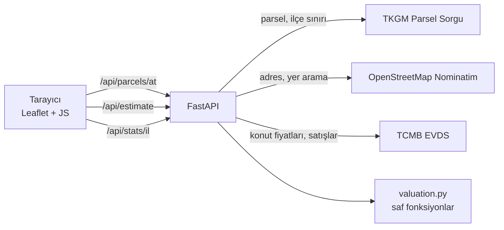

# Değerix

[](https://github.com/kayaal34/degerix/actions/workflows/tests.yml)

Haritada bir arsaya tıklayın ya da ada/parsel numarasını girin. Değerix, parseli
**TKGM (Tapu ve Kadastro) kaydından** bulur ve sınırını haritada çizer. İmar, tapu,
yol ve altyapı sorularıyla tahmini değeri **acil satış, piyasa değeri ve tok satıcı**
senaryolarıyla birlikte hesaplar. Hesabın dökümünü ve **TCMB verisiyle bölge analizini** gösterir.

**Teknolojiler:** Python 3.12 · FastAPI · httpx · Leaflet · Vanilla JS · pytest · GitHub Actions · TCMB EVDS

## Özellikler

- **Haritadan seçim:** tıklanan noktadaki gerçek parsel TKGM'den gelir: ada, parsel, yüzölçümü, nitelik ve sınır poligonu.
- **Ada / parsel ile arama:** il → ilçe → mahalle listeleri de TKGM'den gelir.
- **Arsa soruları:** imar durumu ve emsal (KAKS, inşaat alanı canlı hesaplanır), müstakil/hisseli tapu (hisse payının değeri ayrıca gösterilir), yol cephesi, elektrik ve su, deniz/göl manzarası, köşe parsel (imarlı arsada), sulu/kuru (imarsız arazide). Sorular yalnızca ilgili durumda görünür; zeytinlikte yasal kısıt uyarısı çıkar.
- **Parsel çevresi:** kıyıya ve ana yola mesafe, 1 km içindeki okul/sağlık/market noktaları ve eğim otomatik ölçülür. Ölçüm 4 saniyede yetişmezse değer beklemeden gösterilir.
- **Satış süresine göre fiyat:** acil satış (1–2 ay), piyasa değeri (3–6 ay) ve tok satıcı (6 ay+) için ayrı fiyat ve aralık.
- **Bölge analizi:** TCMB EVDS'den ilin konut m² fiyatı, bölge konut fiyat endeksi (24 aylık grafik) ve son 12 ayın konut satışları.
- **Şeffaf hesap:** değer aralığı, güven düzeyi ve her çarpanın gerekçesi gösterilir. "Bilmiyorum" denen sorular aralığı genişletir.
- **Telefonda:** arsanın üzerindeyken "Bulunduğum yeri seç" ile parseli GPS'ten bulma, dokunmatik uyumlu arayüz.
- **Harita / Uydu düğmesi:** parsel seçilince uydu görüntüsü kendiliğinden açılır; kullanıcının kendi seçimi hatırlanır.
- **Yer arama** (OpenStreetMap) ve **paylaşılabilir bağlantı** (`?lat=..&lng=..`).
- **Yedek akış:** parsel kaydı olmayan noktalarda il/ilçe OpenStreetMap'ten alınır, alanı kullanıcı girer.

## Nasıl çalışır?



Tarayıcı dış servislere doğrudan gitmez; FastAPI araya girer. Bunun üç faydası var:

- **Tutarsız yanıtlar tek yerde düzeltilir.** TKGM alanı bazen `45,911.00`, bazen `45.911,00` biçiminde döndürüyor; bazı adları da "Gölbaşi" gibi bozuk yazıyor.
- **Anahtar ve önbellek sunucuda kalır.** EVDS API anahtarı tarayıcıya hiç gitmez; idari listeler ve EVDS yanıtları önbelleğe alınır.
- **Hız sınırlarına uyulur.** Nominatim'in saniyede bir istek sınırı aşılmaz.

## Değerleme modeli

Referans fiyat, konut imarlı, emsali 1,00 olan, yola cepheli ve müstakil tapulu arsa içindir.
Diğer her özellik bu fiyatı bir katsayıyla çarpar:

| Çarpan | Nasıl belirlenir | Aralık |
|---|---|---|
| İlçe | bilinen ilçeler için bölge farkı | 0,77 – 2,30 |
| Konum | ilçenin coğrafi merkezine uzaklık (TKGM ilçe sınırından) | 0,85 – 1,10 |
| Denize yakınlık | kıyı çizgisine mesafe (OpenStreetMap); 3 km ötesinde etkisiz | 1,00 – 1,20 |
| Ana yola erişim | en yakın ana yola mesafe (OpenStreetMap) | 0,90 – 1,05 |
| Çevre hizmetleri | 1 km içindeki okul, sağlık ve market noktası sayısı (OpenStreetMap) | 0,95 – 1,05 |
| Eğim | parselin çevresindeki yükselti farkı (Open-Meteo, Copernicus 90 m) | 0,85 – 1,00 |
| İmar durumu | konut / ticari / sanayi imarlı ya da imarsız bağ-bahçe, zeytinlik, tarla | 0,22 – 1,45 |
| Emsal (KAKS) | yalnızca imarlı arsada; inşaat hakkı arttıkça değer artar ama orantısız | 0,50 – 1,80 |
| Büyüklük | büyük parselde m² fiyatı düşer | 0,65 – 1,08 |
| Tapu | hisseli tapuda ortaklık indirimi | 0,80 – 1,00 |
| Yol cephesi | yola cephesi yoksa geçit hakkı gerekir | 0,75 – 1,00 |
| Elektrik ve su | eksikse düşer; tarlada etkisi daha az | 0,85 – 1,00 |

**Değer aralığı ve güven:** her eksik bilgi aralığı genişletir. Tanımsız ilçe, alınamayan
konum, imarsız arazi, girilmemiş emsal ve "Bilmiyorum" denen her soru aralığa eklenir.
Kullanıcı yanıtladıkça aralık daralır, güven "düşük → orta → yüksek" olur.

**Satış senaryoları:** piyasa değeri 3–6 aylık normal satışı temsil eder. Acil satışta
imarlı arsa ×0,85, imarsız arazi ×0,78 (arazi daha yavaş satılır); tok satıcıda
×1,08 / ×1,10 uygulanır.

Model deterministiktir: aynı girdi her zaman aynı sonucu verir.

Örnek: Bodrum, Yeniköy, 1108 ada 6 parsel (467,87 m², konut imarlı, sorular yanıtlanmamış)

| Adım | Çarpan | m² fiyatı |
|---|---|---|
| Muğla referans fiyatı | | ₺8.800 |
| İlçe: Bodrum | × 2,30 | |
| Konum: ilçe merkezine 7,8 km | × 0,98 | |
| İmar durumu: konut imarlı | × 1,00 | |
| Emsal: girilmedi, 1,00 varsayıldı | × 1,00 | |
| Büyüklük: 468 m² | × 1,01 | |
| Tapu, yol cephesi, elektrik-su: yanıtlanmadı | × 1,00 | |
| **Sonuç** | | **₺19.900** → **₺9.310.000** |

| Senaryo | Fiyat | Aralık |
|---|---|---|
| Acil satış (1–2 ay) | 7,9 milyon ₺ | 6,5 – 9,3 milyon ₺ |
| Piyasa değeri (3–6 ay) | 9,3 milyon ₺ | 7,6 – 11 milyon ₺ |
| Tok satıcı (6 ay+) | 10,1 milyon ₺ | 8,3 – 11,9 milyon ₺ |

> **Önemli:** `app/data.py` içindeki referans fiyatlar ve katsayılar gerçek piyasa verisi
> değil, modelin çalışmasını göstermek için seçilmiş örnek değerlerdir. Parsel bilgileri
> (konum, alan, nitelik) ve bölge analizi ise gerçek veridir. Gerçek bir arsa fiyatı kaynağı
> bağlandığında yalnızca `data.py` dosyasının değişmesi yeterlidir.

## Bölge analizi (TCMB EVDS)

Seçilen parselin ili için Merkez Bankası'nın Elektronik Veri Dağıtım Sistemi'nden (EVDS)
üç resmî seri çekilir:

| Gösterge | EVDS serisi | Sıklık | Kapsam |
|---|---|---|---|
| Konut m² fiyatı ve geçen yılın aynı dönemine göre değişim | `TP.BIRIMFIYAT.<il>` | üç aylık | 76 il |
| Konut fiyat endeksi, son 12 ay değişimi ve 24 aylık grafik | `TP.KFE.<bölge>` | aylık | 19 bölge, 81 il |
| Son 12 ayın konut satışı ve önceki yıla göre değişim | `TP.AKONUTSAT1.<il>` | aylık | 81 il |

Örnek (Muğla, Eylül 2026):

| Gösterge | Değer |
|---|---|
| Konut m² fiyatı (2026 2. çeyrek) | ₺82.290, geçen yıla göre +%4,1 |
| Konut fiyat endeksi, Aydın–Denizli–Muğla (son 12 ay) | +%17,7 |
| Konut satışı (son 12 ay) | 23.004 adet, önceki yıla göre −%5,8 |

- **Konut verisidir.** Arsa fiyatını doğrudan göstermez; bölgedeki eğilimi gösterir. Değişimler nominaldir, enflasyon dahildir.
- **Birim fiyatı olmayan iller:** Ardahan, Bayburt, Gümüşhane, Hakkari ve Tunceli için TCMB konut birim fiyatı yayımlamıyor; bu illerde yalnızca endeks ve satışlar gösterilir.
- **Bir seri alınamazsa** diğerleri yine gösterilir. Yanıtlar 12 saat önbellekte tutulur.
- **Anahtar yoksa** uygulama normal çalışır, yalnızca bölge analizi kartı görünmez. Arayüz `/api/health` yanıtındaki `stats` alanına bakar ve anahtar yokken istek atmaz.

## Çalıştırma

Python 3.12 gerekir.

```bash
python -m venv .venv
```

```bash
.venv\Scripts\activate
```

```bash
pip install -r requirements.txt
```

```bash
uvicorn app.main:app --reload
```

- Arayüz: <http://localhost:8000>
- API dokümanı (Swagger): <http://localhost:8000/docs>

### EVDS API anahtarı (bölge analizi için, isteğe bağlı)

1. [evds3.tcmb.gov.tr](https://evds3.tcmb.gov.tr) adresinde ücretsiz üye olun ve profil sayfanızdan API anahtarınızı kopyalayın.
2. [`.env.example`](.env.example) dosyasını `.env` adıyla kopyalayın.
3. Anahtarı `EVDS_API_KEY=` satırına tırnaksız yapıştırın ve sunucuyu yeniden başlatın.

`.env` git'e gönderilmez. Anahtar yalnızca sunucuda kullanılır, tarayıcıya gönderilmez.

### Telefondan denemek (aynı Wi-Fi)

Sunucuyu yerel ağa açın:

```bash
uvicorn app.main:app --host 0.0.0.0 --port 8000
```

Bilgisayarın yerel IP adresini `ipconfig` ile öğrenin (ör. `192.168.1.34`) ve telefonda
`http://192.168.1.34:8000` adresini açın. Windows güvenlik duvarı izin isteyebilir.

"Bulunduğum yeri seç" düğmesi tarayıcı kuralı gereği yalnızca **https** üzerinde çalışır;
yerel ağda çalışmaz, yayınlanmış sürümde çalışır.

## Yayınlama (Render)

Depoda hazır bir [`render.yaml`](render.yaml) bulunur.

1. [render.com](https://render.com)'a GitHub hesabıyla giriş yapın.
2. **New → Blueprint** seçip bu depoyu bağlayın.
3. Render `EVDS_API_KEY` değerini sorar; anahtarınızı buraya girin. Boş bırakırsanız bölge analizi kapalı kalır.
4. Render servisi kurar ve `https://degerix-xxxx.onrender.com` biçiminde bir adres verir. Her `git push` sonrası otomatik güncellenir.

Ücretsiz planda servis 15 dakika istek almazsa uyur; sonraki ilk açılış yaklaşık bir dakika sürer.

## Testler

```bash
pytest
```

Testler ağa çıkmadan çalışır; TKGM, Nominatim, EVDS, OpenStreetMap ve yükselti servisi sabit verilerle taklit edilir. Her push'ta GitHub Actions üzerinde de çalışır. Kapsanan konular:

- **Değerleme modeli:** determinizm, dökümün tutarlılığı, sorulara ve senaryolara göre değer ve aralık, güven düzeyleri
- **Çevre ölçümleri:** kıyıya ve yola mesafe hesabı, katsayı sınırları, eksik ölçümlerin atlanması, önbellek
- **Bölge analizi:** 81 ilin seri eşleştirmesi, dönem hesapları, boş dönemler, kısmi ve tam servis kesintisi, önbellek
- **Coğrafi hesaplar:** mesafe, poligon merkezi ve alanı
- **Veri ayrıştırma:** TKGM'nin iki farklı sayı biçimi, nitelik metninden imar durumu tahmini
- **API:** yedek akışlar (TKGM kapalıyken ya da parsel yokken), 404/422/502/503 yanıtları

## API

| Metot | Yol | Açıklama |
|---|---|---|
| GET | `/api/parcels/at?lat=&lng=` | Koordinattaki parsel; kayıt yoksa OSM adresi (`source: "osm"`) |
| GET | `/api/parcels/{mahalle_id}/{ada}/{parsel}` | Ada/parsel ile parsel |
| POST | `/api/estimate` | Tahmin, döküm ve satış senaryoları (gövde aşağıda) |
| GET | `/api/stats/{il}` | Bölge analizi; EVDS anahtarı yoksa 503 |
| GET | `/api/provinces` · `/api/provinces/{id}/districts` · `/api/districts/{id}/neighborhoods` | İdari listeler |
| GET | `/api/search?q=` | Yer arama |
| GET | `/api/usages` | İmar durumları (`zoned`: emsal sorulur mu) |
| GET | `/api/health` | Servis durumu (`stats`: bölge analizi açık mı) |

`/api/estimate` gövdesi:

```json
{
  "province": "Muğla", "district": "Bodrum", "area_m2": 467.87, "usage": "konut",
  "lat": 37.0385, "lng": 27.419, "province_id": 70, "district_id": 724,
  "kaks": 1.5, "deed": "hisseli", "share_pct": 25, "road": "var", "utilities": "kismen"
}
```

Seçenekli alanların değerleri:

- `deed`: `tam` · `hisseli` · `bilinmiyor`
- `road`: `var` · `yok` · `bilinmiyor`
- `utilities`: `var` · `kismen` · `yok` · `bilinmiyor`

Konum, kimlikler ve sorular isteğe bağlıdır.

Hata yanıtları `{"detail": "Türkçe açıklama"}` biçimindedir:

| Kod | Durum |
|---|---|
| 404 | Kayıt yok |
| 422 | Girdi geçersiz |
| 502 | Dış servise ulaşılamadı |
| 503 | Bölge analizi kapalı (EVDS anahtarı yok) |

## Proje yapısı

```text
app/
  main.py          FastAPI uç noktaları ve şemalar
  valuation.py     değerleme modeli (saf fonksiyonlar)
  data.py          referans fiyatlar, katsayılar, Türkçe ad eşleştirme
  geo.py           mesafe, poligon merkezi ve alanı
  tkgm.py          TKGM istemcisi + önbellek
  nominatim.py     OpenStreetMap istemcisi (hız sınırlı)
  evds.py          TCMB EVDS istemcisi ve bölge analizi özetleri
  evds_series.py   81 il için EVDS seri kodları
  surroundings.py  çevre katsayıları: kıyı, ana yol, hizmetler, eğim (saf fonksiyonlar)
  nearby.py        OpenStreetMap Overpass ve Open-Meteo yükselti ölçümleri + önbellek
  errors.py        ortak hata tipleri
static/            arayüz (index.html, style.css, app.js)
data/pilot/        Bursa pilot veri seti şablonu ve derleme kuralları
tests/             pytest
render.yaml        Render yayın tanımı
```

## Bilinen sınırlamalar

- **TKGM API'si:** kullanılan TKGM uç noktaları parselsorgu.tkgm.gov.tr'nin herkese açık servisidir, resmî olarak belgelenmemiştir. Biçim değişebilir ve yoğun kullanımda istek sınırına takılabilir.
- **Konum katsayısı:** ilçenin coğrafi merkezini kullanır. Bu nokta her zaman şehir merkezi değildir; geniş ilçelerde (ör. Çankaya) sapma olabileceği için etki 0,85 – 1,10 bandında tutulur.
- **Nitelik ≠ imar durumu:** nitelikten tahmin edilen imar durumu yalnızca bir öneridir; gerçek imar durumu ve emsal belediyeden öğrenilmelidir.
- **Bölge verisi konut içindir:** EVDS arsa fiyatı yayımlamaz. Üç aylık birim fiyatlar küçük illerde az sayıda satışa dayandığı için dönemden döneme dalgalanabilir.
- **Harita altlıkları:** OpenStreetMap karoları ve Esri uydu görüntüsü API anahtarı gerektirmez ama düşük trafikli kullanım içindir ([OSM karo politikası](https://operations.osmfoundation.org/policies/tiles/)). Yoğun trafikte ücretli bir karo sağlayıcısına geçilmelidir.

## Yol haritası

- **Emsal girişi:** kullanıcının bulduğu ilan fiyatlarından bölge ortalaması
- **Referans fiyatların güncellenmesi:** EVDS konut fiyat endeksindeki değişimle `data.py` fiyatlarının dönemsel olarak güncellenmesi

## Yasal uyarı

Değerix bir portfolyo projesidir. Sunulan tahminler bilgilendirme amaçlıdır; yatırım
tavsiyesi değildir ve SPK lisanslı gayrimenkul değerleme raporu yerine geçmez.
